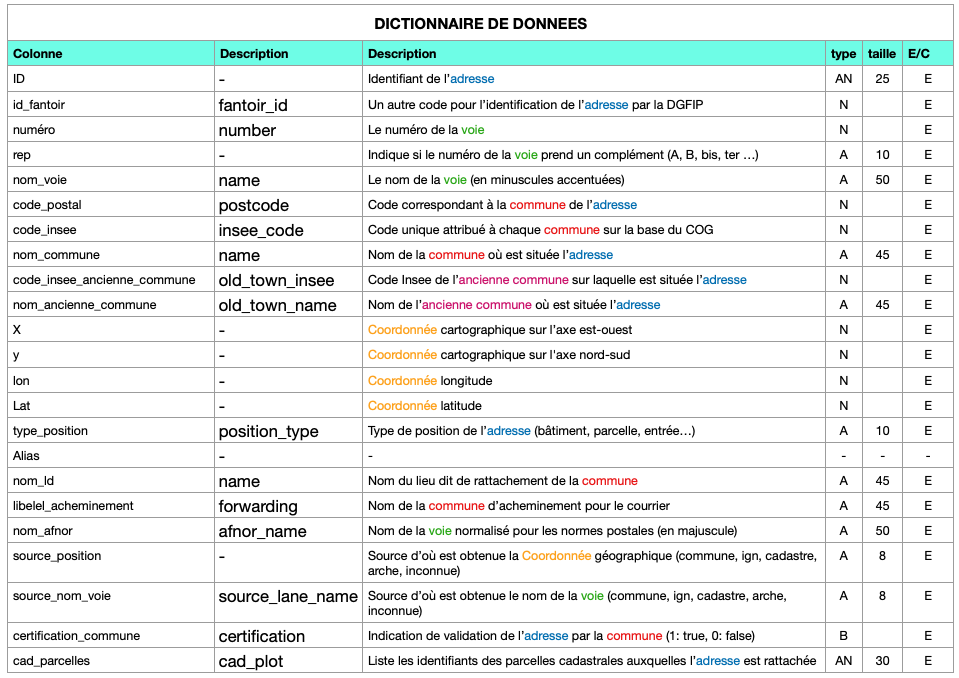

# CDA-brief4-DB

# ETAPES DE VALIDATION

## découverte de la donnée

- télécharger un fichier CSV au choix depuis https://adresse.data.gouv.fr/data/ban/adresses/latest/csv/
- créer un dictionnaire de données et les règles de gestion


- importer le fichier dans une table brute
**établir la connection postgreSQL/DBeaver**
- ouvrir DBeaver
- se connecter à la base de données PostgreSQL souhaitée
**importer les données**
- dans l'arborescence de la base faire un **clic droit** sur `public` et sélectionner **import data**
- choisir le type de source `CSV`
- sélectionner le fichier téléchargé

⚠️ les données en français sont souvent séparées par un ; plutôt qu'une , penser à modifier le séparateur dans DBeaver avant de lancer l'import.


## modélisation MERISE

## mise en place de la base

## requêtes SQL

### requêtes de consultation

- lister toutes les adresses d'une commune donnée, triées par voie

```sql 
SELECT * FROM adress WHERE id_town = ? ORDER BY id_lane
```