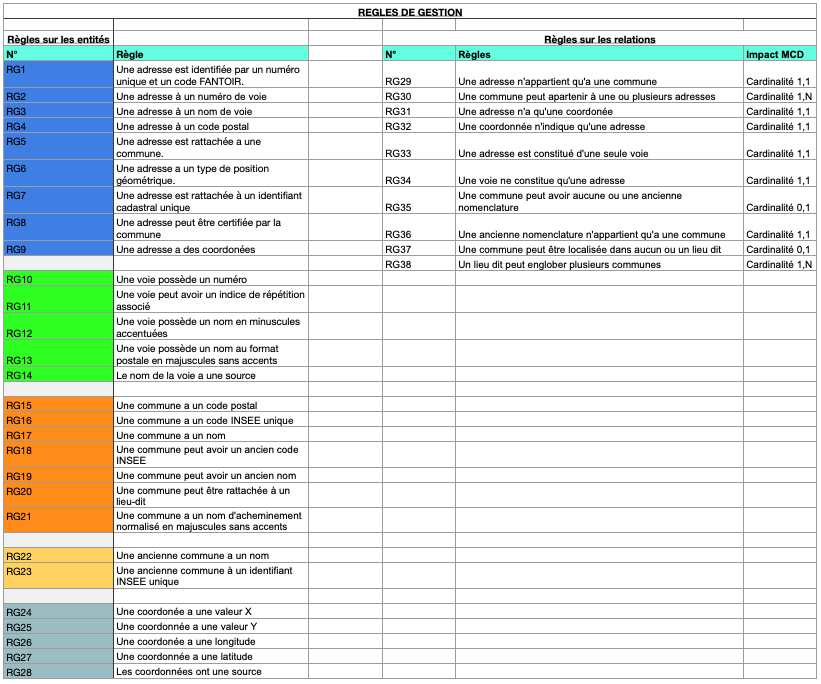
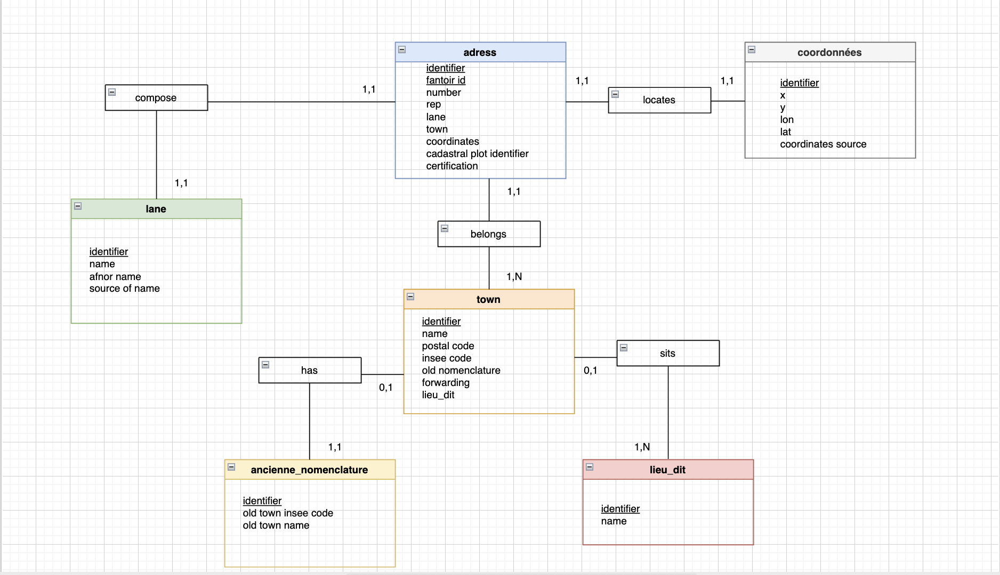
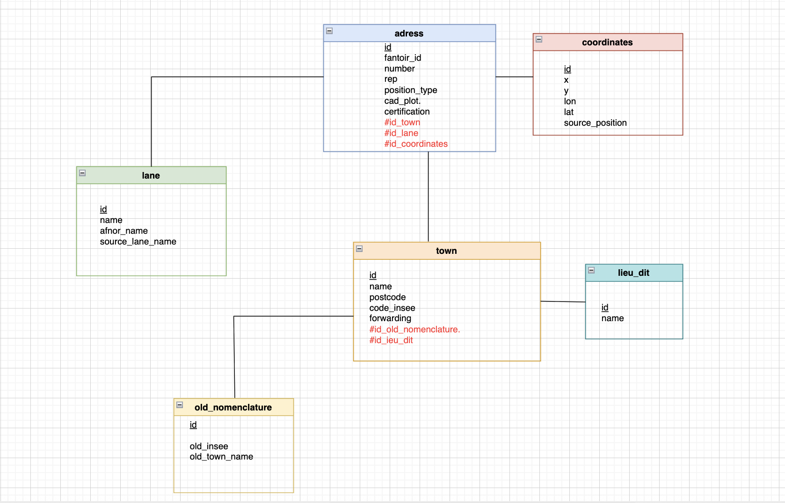
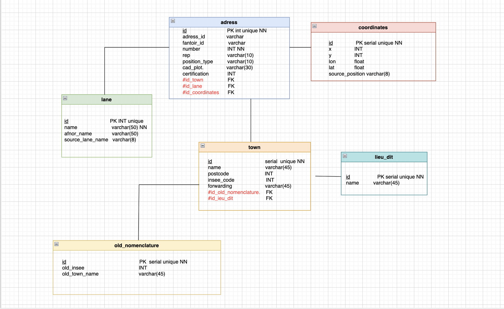

# CDA-brief4-DB

# ETAPES DE VALIDATION

## découverte de la donnée
- télécharger un fichier CSV au choix depuis https://adresse.data.gouv.fr/data/ban/adresses/latest/csv/
- créer un dictionnaire de données.


- importer le fichier dans une table brute
**établir la connection postgreSQL/DBeaver**
- ouvrir DBeaver
- se connecter à la base de données PostgreSQL souhaitée
**importer les données**
- dans l'arborescence de la base faire un **clic droit** sur `public` et sélectionner **import data**
- choisir le type de source `CSV`
- sélectionner le fichier téléchargé

⚠️ les données en français sont souvent séparées par un `;` plutôt qu'une `,` penser à modifier le séparateur dans DBeaver avant de lancer l'import.

**identifier les entités et les relations potentielles**
- créer un fichier de règles de gestion pour découper les données en entité et définir des relations

- une fois les entités repérées et les relations établies, passer à la modélisation de la base.
## modélisation MERISE
- créer un **MCD** reprenant les entités définies et leurs champs ainsi que les relations avec cardinalités

- créer un **MLD** formalisant les relations entre les tables par le biais de clé étrangères

- créer un **MPD** en indiquant chaque type de données

## mise en place de la base
-créer les tables issues du MPD
⚠️ commencer par les tables indépendantes de toute relation pour éviter les erreurs
**pour chaque table crées sur le MPD**
```sql
CREATE TABLE nom_de_la_table(
    colonne1 type de donnée contrainte, 
    colonne2 type de donnée contrainte,
    ...
);
````
le cas échéant, ajouter un **constraint** pour les clés étrangères

``constraint fk_nom_de_la_clé_étrangère 
foreign key (nom_de_la_clé_étrangère) 
references table_de_référence(identifiant)
 ``
 - Créer un jeu d’échantillon depuis le fichier d’adresse complet pour faire les tests de requêtes.

 ``sql
CREATE TABLE adress_sample as
SELECT * FROM adresses LIMIT 100
 ``

- créer un **script SQL** pour insérer les données dans les tables crées depuis le jeu de données
[script d'insertion de données](./data_insert_script.sql)
## requêtes SQL

### requêtes de consultation

- créer un **script SQL** pour les requêtes de consultation
[script de consultation des données](./request_consult.sql)